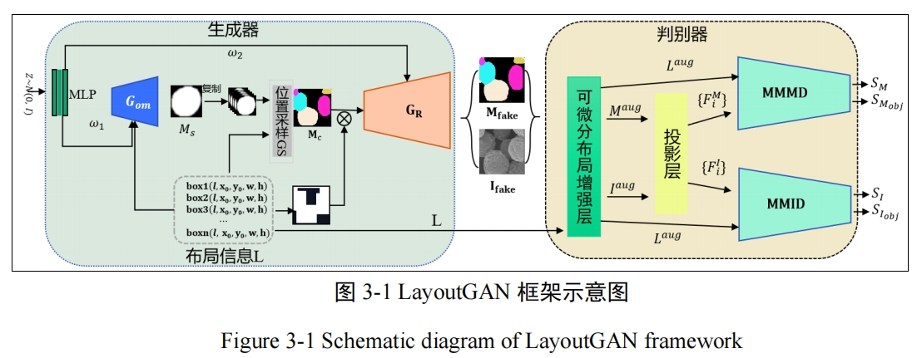
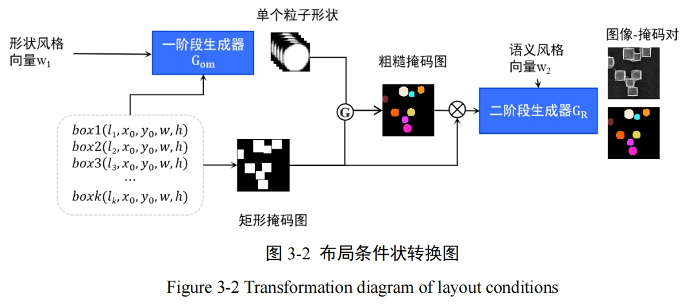
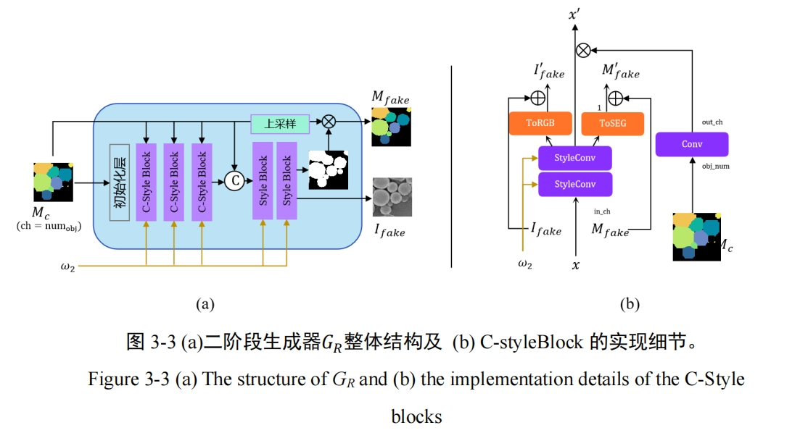
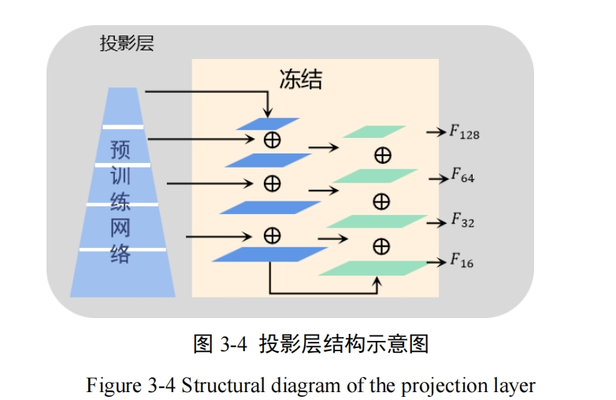
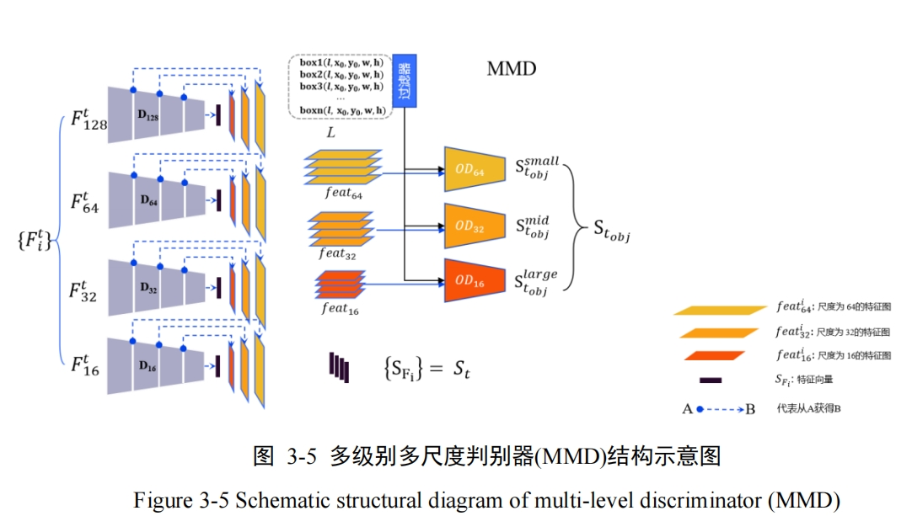

## LayoutGAN &lwlhsa; 

### Abstract
&emsp;&emsp;In recent years, artificial intelligence has rapidly developed with vigor, greatly improving our lives and various fields of research with its unique charm and outstanding performance. Particularly in the study of phenotypes of drug nanoparticles, the use of artificial intelligence technology has simplified repetitive and time-consuming tasks, further enhancing research efficiency. However, artificial intelligence technologies, especially those based on deep learning, often require large amounts of supervised training data to support efficient performance of models in application scenarios. Therefore, expanding datasets with supervised information has become one of the problems many research works are committed to solving.  
&emsp;&emsp;This thesis aims to expand datasets by generating synthetic algorithm-based drug example images and their supervised information that conform to the real distribution, thereby addressing issues such as poor accuracy caused by lack of annotated information in downstream algorithms. Taking the dataset of drug nanoparticles obtained by electron microscopy scanning as an example, this thesis uses synthetic algorithms to generate image-mask data pairs of nanoparticles that conform to specific layouts and feature distributions on datasets with a small amount of manually annotated supervised information.   
&emsp;&emsp;This thesis proposes a LayoutGAN model that integrates layout condition control into generative adversarial networks to synthesize drug particle image and mask data. To embed layout conditions and generate high-quality drug particle images, this thesis proposes a two-stage generator and a multi-level multi-scale image-mask discriminator. To further synthesize fine-grained masks, this thesis proposes an image-mask correlation loss to ensure strong correlation between synthesized images and masks. To enhance the robustness of the model, this thesis introduces a differentiable layout enhancement strategy into the discriminator's input and ensures strong stability of the model with a small number of training samples.  

-----







```bash
python train.py --data=<your dataset> --data2=<your layout dataset> \
                                        --outdir=results_all \
                                        --gpus=1 --batch=16 --cfg=stylegan2

                                        # --subset=$NUM 
```
